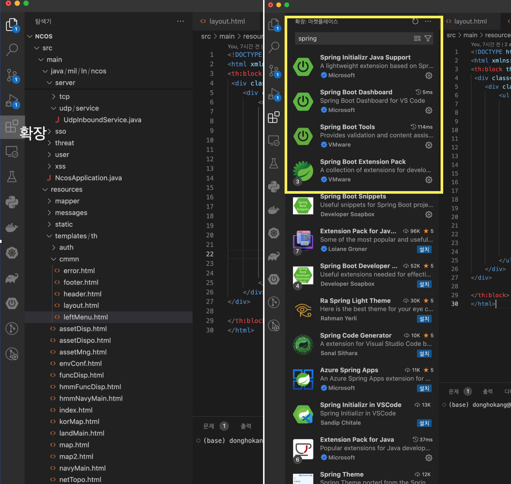
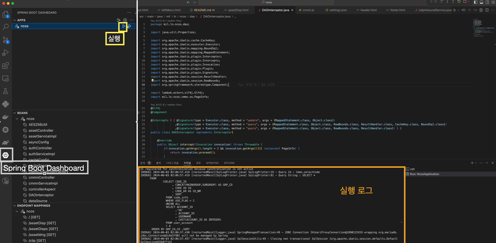
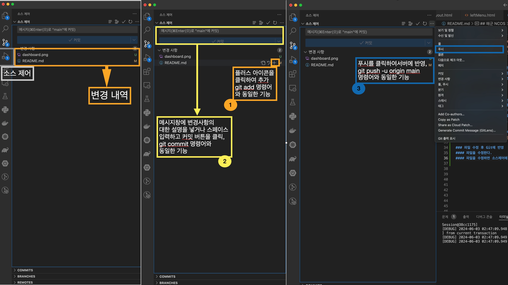

## 해군 NCOS 
### 해당 프로젝트는 VSCODE,Git 작업환경으로 구성되어 있습니다.

### VS CODE 설치
#### VS Code 다운로드 👉 https://code.visualstudio.com/

### Git 설치
#### Git 다운로드 👉 https://git-scm.com/downloads

### Spring Boot 개발을 위한 확장 Pack 설치
#### Spring Boot 개발을 위해 vscode의 왼쪽 메뉴에 있는 확장 아이콘을 클릭하고, 검색창에 spring을 입력 후 검색돈 4가지 확장팩을 설치합니다.
#### 1.Spring Initializer Java Support
#### 2.Spring Boot Dashboard
#### 3.Spring Boot Tools
#### 4.Spring Boot Extension Pack

<!--  -->

### Java 환경설정 및 그 외 확장팩 설치
#### Java 17 설치 후 환경설정(구글링)
#### Lombok Annotations Support for VS Code
#### ...

### Git Clone 프로젝트 생성
#### https://mangchinas.synology.me/thesys/ncos 접속
#### 상단의 페이지에 접속시 회원이 아닐 경우 회원 가입을 하고 로그인합니다.
#### 회원가입을 완료하고 로그인하면 thesys/nocs 프로젝트 인트로 화면이 전시됩니다.
#### 오른쪽 상단의 ... 아이콘을 클릭하여 Clone in VS Code를 클릭합니다.
#### 로컬 레파지토리를 설정하고 저장을 하면 VS Code가 실행되고 ncos 프로젝트 생성됩니다.

### Spring Boot Dashboard에서 application 실행

### Git 초기 설정
#### VS Coded에서 소스 제어에서 Git 작업을 수행할려고 할 때 사용자명 및 email설정을 하라는 메시지가 니올 경우에 터미널 창을 아래와 같이 입력한다.
#### git config --global user.name "username"
#### git config --global user.email "username@gmail.com" 

### 파일 수정 후 Git에 반영
#### 파일을 수정한다.
#### 파일을 수정하면 소스제어에 수정된 파일이 표시된다.
#### 1. 변경된 파일리스트에서 오른쪽 +아이콘을 클릭하여 변경 대상에 추가한다. git add {파일명}
#### 2. 변경된 파일을 커밋한다. git commit -m "commt msg"
#### 3. git 서버에 반영한다. git push -u origin main 

#토큰
9421e28810ed63f78f8abd39738e279facb5ae50
